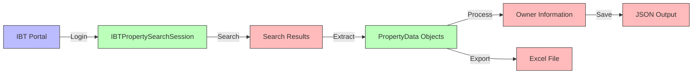

# IBT Property Search Workflow

```mermaid
flowchart TD
    Start([Start]) --> ParseArgs[Parse Command Line Arguments]
    ParseArgs --> SetupLogging[Setup Logging]
    SetupLogging --> InitPlaywright[Initialize Playwright]
    
    subgraph Initialization
        InitPlaywright --> CreateSearcher[Create IBTPropertySearcher]
        CreateSearcher --> InitBrowser[Initialize Browser Session]
        InitBrowser --> LoadOTPSecret[Load OTP Secret from Environment]
    end
    
    subgraph Authentication
        LoadOTPSecret --> Login[Login to IBT Portal]
        Login --> CheckOTP{OTP Required?}
        CheckOTP -->|Yes| GenerateOTP[Generate OTP Code]
        GenerateOTP --> EnterOTP[Enter OTP]
        EnterOTP --> WaitForAuth[Wait for Authentication]
        CheckOTP -->|No| NavigateToSearch[Navigate to Property Search]
        WaitForAuth --> NavigateToSearch
    end
    
    subgraph PropertySearch
        NavigateToSearch --> CheckArea{Area Specified?}
        CheckArea -->|Yes| SearchByArea[Search Properties by Area]
        SearchByArea --> SetSearchCriteria[Set Search Criteria]
        SetSearchCriteria --> ClickSearch[Click Search Button]
        ClickSearch --> WaitForResults[Wait for Search Results]
        WaitForResults --> DownloadExcel[Download Results as Excel]
    end
    
    subgraph DataExtraction
        DownloadExcel --> CheckExtractOwners{Extract All Owners?}
        CheckExtractOwners -->|Yes| ExtractProperties[Extract Properties from Results]
        ExtractProperties --> ProcessProperties[Process Properties]
        ProcessProperties --> ExtractOwnerInfo[Extract Owner Information]
        
        CheckExtractOwners -->|No| CheckPropertyID{Property ID Specified?}
        CheckPropertyID -->|Yes| GetPropertyDetails[Get Property Details]
        GetPropertyDetails --> OpenPropertyDetails[Open Property Details]
        OpenPropertyDetails --> GetOwnerInfo[Get Owner Information]
        
        ExtractOwnerInfo --> SaveResults[Save Results to File]
        GetOwnerInfo --> SaveResults
        CheckPropertyID -->|No| NoAction[No Action]
    end
    
    subgraph RecordingMode
        SaveResults --> CheckRecording{Recording Mode?}
        CheckRecording -->|Yes| RecordEvents[Record Browser Events]
        RecordEvents --> SaveEvents[Save Events Periodically]
        SaveEvents --> WaitForExit[Wait for Exit Key]
        WaitForExit --> FinalSave[Final Save of Events]
        CheckRecording -->|No| WaitForEnter[Wait for Enter to Exit]
    end
    
    subgraph Cleanup
        FinalSave --> CloseBrowser[Close Browser]
        WaitForEnter --> CloseBrowser
        NoAction --> CloseBrowser
        CloseBrowser --> StopPlaywright[Stop Playwright]
        StopPlaywright --> End([End])
    end
    
    %% Class definitions
    classDef process fill:#f9f,stroke:#333,stroke-width:1px;
    classDef decision fill:#bbf,stroke:#333,stroke-width:1px;
    classDef io fill:#bfb,stroke:#333,stroke-width:1px;
    
    %% Apply classes
    class Start,End io;
    class CheckOTP,CheckArea,CheckExtractOwners,CheckPropertyID,CheckRecording decision;
    class Login,SearchByArea,ExtractProperties,GetPropertyDetails,SaveResults process;
```



## Key Components

### Classes
- **PropertyData**: Data model for property information
- **CustomTOTP**: Custom TOTP implementation for authentication
- **IBTPropertySearchSession**: Handles individual browser session for property searching
- **IBTPropertySearcher**: Main class for searching properties in the IBT portal

### Main Functions
- **setup_logging**: Configure logging
- **main**: Main entry point
- **login**: Handle login process
- **search_by_area**: Search for properties by area
- **extract_properties_from_results**: Extract property data from search results
- **get_owner_information**: Extract owner information
- **download_search_results_excel**: Download search results as Excel file

## Data Flow



## Class Relationships

```mermaid
classDiagram
    class PropertyData {
        +property_id: str
        +address: str
        +postal_code: str
        +city: str
        +status: str
        +owner_name: str
        +owner_address: str
        +owner_contact: str
        +owner_details_loaded: bool
        +additional_fields: dict
    }
    
    class CustomTOTP {
        +secret: str
        +digits: int
        +digest: str
        +interval: int
        +generate_otp(input)
        +now()
        +generate_code(input)
    }
    
    class IBTPropertySearchSession {
        +username: str
        +password: str
        +session_id: int
        +headless: bool
        +recording_mode: bool
        +browser: Browser
        +page: Page
        +init_browser()
        +login()
        +search_by_area(area)
        +extract_properties_from_results()
        +get_owner_information(property_data)
        +download_search_results_excel()
        +close()
    }
    
    class IBTPropertySearcher {
        +username: str
        +password: str
        +session: IBTPropertySearchSession
        +init()
        +login()
        +search_by_area(area)
        +get_property_details_with_owner(property_id)
        +extract_owner_information_for_all_properties(properties)
        +close()
    }
    
    IBTPropertySearcher --> IBTPropertySearchSession : uses
    IBTPropertySearchSession --> PropertyData : creates
    IBTPropertySearchSession --> CustomTOTP : uses for OTP
