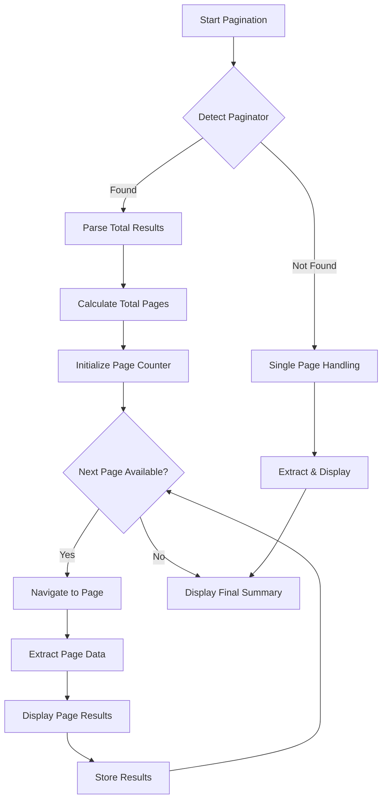

# Pagination Enhancement Implementation Plan

## Real-Time Display Workflow


## Key Implementation Components

### 1. Page-by-Page Display Logic
```python
async def display_page_results(self, properties, current_page, total_pages):
    """Display formatted results for current page"""
    console.print(f"\n[yellow]Page {current_page}/{total_pages}[/yellow]")
    
    page_table = Table(show_header=True, header_style="bold cyan")
    page_table.add_column("Property ID")
    page_table.add_column("Address")
    page_table.add_column("Status")
    
    for prop in properties:
        page_table.add_row(
            prop.property_id,
            f"{prop.address or ''} {prop.postal_code or ''}",
            prop.status or "Unknown"
        )
    
    console.print(page_table)
    console.print(f"[green]{len(properties)} properties extracted[/green]")
```

### 2. Error Handling Strategy
```python
try:
    props = await self.extract_properties_from_results()
except Exception as e:
    console.print(f"\n[red]Page {page_num} Error:[/red] {str(e)}")
    logging.error(f"Page {page_num} failure: {traceback.format_exc()}")
    continue
```

### 3. Progress Tracking
```python
# Progress bar simulation
progress = f"[{current_page}/{total_pages}]".ljust(10)
console.print(f"{progress} [cyan]{'■' * current_page}{'□' * (total_pages - current_page)}[/cyan]")
```

## Validation Checklist
- [ ] Single page results display correctly
- [ ] Multi-page navigation maintains session
- [ ] Errors in middle pages don't abort entire process
- [ ] Final summary includes all collected data
- [ ] Progress indicators update in real-time

## Rollback Plan
1. Maintain original `search_by_area` method
2. Feature flag new pagination logic
3. Automated tests for both implementations