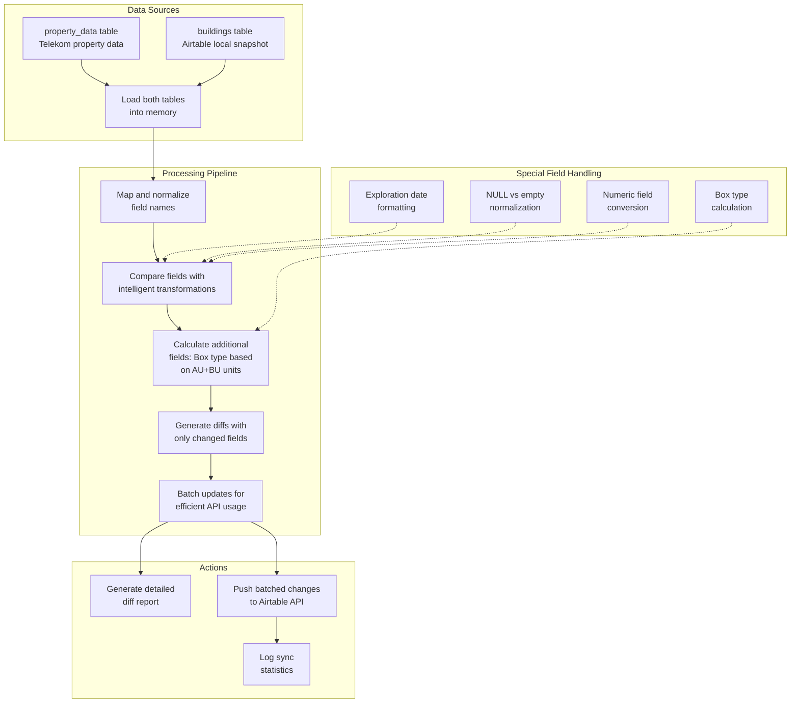

# sync_changes.py

A Python utility for synchronizing property data between local SQLite database tables and Airtable.

## Overview

`sync_changes.py` identifies differences between the `property_data` table (Telekom data) and the `buildings` table (Airtable snapshot), then pushes only the changed fields to Airtable. The script efficiently batches updates and includes intelligent field mapping and transformation logic.

## Workflow Diagram



## Prerequisites

- Python 3.7+
- Access to a SQLite database with `property_data` and `buildings` tables
- Airtable API key and base configuration in `.env` file
- Required Python packages:
  - `pyairtable`
  - `python-dotenv`
  - `tabulate` (for report generation)

## Configuration

Configuration is loaded from a `.env` file with the following variables:

```
AIRTABLE_API_KEY=your_api_key
AIRTABLE_BASE_ID=your_base_id
AIRTABLE_TABLE_NAME=your_table_name
```

## Field Mappings

The script maps fields between the local database and Airtable:

| Telekom Field (property_data) | Airtable Field (buildings) | Airtable API Field |
|-------------------------------|----------------------------|-------------------|
| fol_id                        | extra_field_1              | Extra field 1     |
| exploration                   | extra_field_3              | Extra field 3     |
| owner_name                    | first_name                 | First name        |
| owner_email                   | email                      | Email             |
| owner_mobile                  | phone_1                    | Phone 1           |
| owner_landline                | phone_2                    | Phone 2           |
| au                            | homes                      | HOMES             |
| bu                            | offices                    | OFFICES           |
| nvt_area                      | nvt                        | NVT               |
| calculated_box                | extra_field_2              | Extra field 2     |

## Special Field Transformations

- **Exploration Date**: Values are stored as "Exploration done: [date]" in Airtable but as just "[date]" in the local database. The script handles this transformation.
  
- **Box Type Calculation**: Based on the sum of accommodation units (AU) and business units (BU), the appropriate box type is calculated and stored in extra_field_2 according to this mapping:

  | Total Units (AU+BU) | Box Type                                            |
  |---------------------|-----------------------------------------------------|
  | 1                   | Box: G-AP OneBox XS (1WE), 10er Pack \| Material Nr.:47122083 |
  | 2-3                 | Box: GI-AP OneBox  1 - 3 WE \| Material Nr.:47100635 |
  | 4-8                 | Box: GI-AP OneBox  4 - 8 WE \| Material Nr.:47100636 |
  | 9-12                | Box: GI-AP OneBox  9 -12 WE \| Material Nr.:47100637 |
  | 13-20               | Box: GI-AP OneBox 13 - 20 WE \| Material Nr.:47100638 |
  | 21-32               | Box: GI-AP OneBox 21 - 32 WE \| Material Nr.:47100639 |

## Usage

### Basic Usage

```bash
python sync_changes.py
```

This will:
1. Generate a diff report (`sync_diff_report.txt`)
2. Push all changes to Airtable in batches

### Command-line Options

```bash
# Generate diff report only without pushing changes
python sync_changes.py --report-only

# Set custom batch size (default is 10)
python sync_changes.py --batch-size 20

# Process only a limited number of records (for testing)
python sync_changes.py --max-records 5

# Enable verbose logging
python sync_changes.py --verbose
```

## Key Components

### Functions

- **load_data_from_sqlite()**: Loads data from both tables into memory for efficient processing
- **compare_records()**: Intelligence comparison of records with special field handling
- **get_box_type_for_units()**: Calculates the appropriate box type based on unit count
- **extract_exploration_date()**: Extracts the date portion from formatted exploration strings
- **sync_changes_to_airtable()**: Main function that orchestrates the entire sync process
- **generate_diff_report()**: Creates a detailed report of all differences

### Data Handling Optimizations

- **NULL vs Empty Handling**: Properly normalizes NULL and empty values to prevent false positives
- **Batch Processing**: Groups updates into batches to minimize API calls
- **Partial Updates**: Only sends changed fields, not entire records
- **Type Normalization**: Handles numeric vs string type differences
- **Whitespace Handling**: Ignores whitespace-only differences

## Log and Report Files

- **Log File**: `airtable_sync_YYYYMMDD_HHMMSS.log` contains detailed operation logs
- **Diff Report**: `sync_diff_report.txt` shows all differences between tables

## Troubleshooting

### Common Issues

- **Authentication Errors**: Check that your `.env` file contains the correct Airtable credentials
- **Empty Diff Report**: Either no differences exist or column mappings need adjustment
- **"Record not found" Errors**: The Airtable record ID may be missing or incorrect

### Debugging Tips

- Use the `--verbose` flag for detailed logging
- Use `--report-only` to examine differences without making changes
- For testing, use `--max-records 3` to limit the number of records processed

## Maintenance

### Adding New Field Mappings

1. Add to `FIELD_MAPPING` dictionary
2. Add to `AIRTABLE_FIELD_NAMES` dictionary
3. Add any special handling logic in `compare_records()`

### Modifying Box Type Logic

Update the `BOX_TYPE_MAPPING` list with new box types and unit ranges.

## Development History

This script was created to efficiently synchronize property data collected from Telekom to Airtable, focusing on minimizing API calls while maintaining data integrity. It implements specific business rules such as box type selection based on unit counts.
